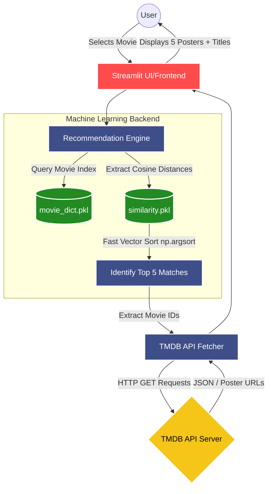

# 🎬 Movie Recommender System


A complete end-to-end Machine Learning web application built with **Streamlit**. This platform recommends movies to users based on their selected movie, operating on an optimized **Content-Based Filtering** algorithm leveraging Cosine Similarity. The app dynamically fetches high-quality movie posters globally using The Movie Database (TMDB) API.

---

## 🏗️ System Architecture & Workflow

The recommendation system is structured into a streamlined data flow pipeline—ranging from user interaction to real-time poster API fetching. 



---

## 🧠 Technical Approach

### 1. The Algorithm: Content-Based Filtering
This system recommends movies by analyzing the similarity of item attributes (such as genres, overview, keywords, cast, and directors). 

- **Text Vectorization**: 
  The raw movie data attributes are preprocessed, stemmed (e.g., using `nltk`), and converted into numerical vectors usually employing `CountVectorizer` or `TF-IDF` to create a dense matrix of features.
- **Cosine Similarity**:
  We compute the angular cosine distance between the movie vectors. The calculated $N \times N$ similarity matrix is persistently stored in `similarity.pkl`.
  
  $Similarity(A, B) = \frac{A \cdot B}{||A|| \times ||B||}$

### 2. Fast Processing & Caching
- Instead of using standard array sorting arrays which operates at $O(n \log n)$, we extract recommendations utilizing `numpy.argsort()`, achieving significantly lower execution times for computing the indices of near-neighbor movies.
- **API Caching**: We utilize `@st.cache_data` on our poster fetching function to maintain high application speed and prevent redundant outbound HTTP calls to the TMDB API.

---

## 🚀 Features

- **Blazing Fast Similarity Lookup**: Retrieves related items in `O(N)` average search via indexed arrays. 
- **Dynamic API Interaction**: Automatically resolves movie IDs and renders up-to-date posters sourced from TMDB API.
- **Responsive Grid Design**: Elegant 5-column layout UI built directly using Streamlit.
- **Cloud Ready**: Configured explicitly for cloud-based deployment servers with included `procfile` & `setup.sh`.

---

## 🛠️ Tech Stack

- **Frontend / Application Framework**: Streamlit
- **Data Manipulation**: Pandas, NumPy
- **Machine Learning Layer**: Scikit-Learn (CountVectorizer, Cosine Similarity)
- **Serialization**: Pickle
- **API Request Handling**: Requests library

---

## ⚙️ Installation & Setup

### Prerequisites
- Python 3.8+
- TMDB API Key (You can obtain one by registering at [TMDB Developers](https://developers.themoviedb.org/3))

### Local Deployment
1. **Clone the repository (or navigate to directory)**
   ```bash
   git clone <your-repository-url>
   cd movie_recomender_system
   ```

2. **Install the dependencies**
   Make sure you have an active virtual environment, then run:
   ```bash
   pip install -r requirements.txt
   ```

3. **Ensure Pre-trained Models are Present**
   You must have the ML files (`movie_dict.pkl` and `similarity.pkl`) in the root directory. *(Since `similarity.pkl` can be large, it may need to be generated using a jupyter notebook or ML pipeline first if not available).*

4. **Launch the Streamlit App**
   ```bash
   streamlit run app.py
   ```

---

## 🌐 Cloud Deployment (Heroku/Render)

This repository includes configuration files required for seamless deployment on platforms like Heroku:
- `procfile`: Instructions indicating what command runs the web dynos.
- `setup.sh`: Bash script setting up `.streamlit/config.toml` variables required for server bindings mapping `$PORT`.

**To Deploy:**
1. Connect this repository to your Cloud Platform service.
2. The infrastructure will detect the `requirements.txt` and install Python components automatically.
3. Configure your build to run the command specified in the `procfile`.

---

*Made with ❤️ for ML and Cinema Enthusiasts.*
